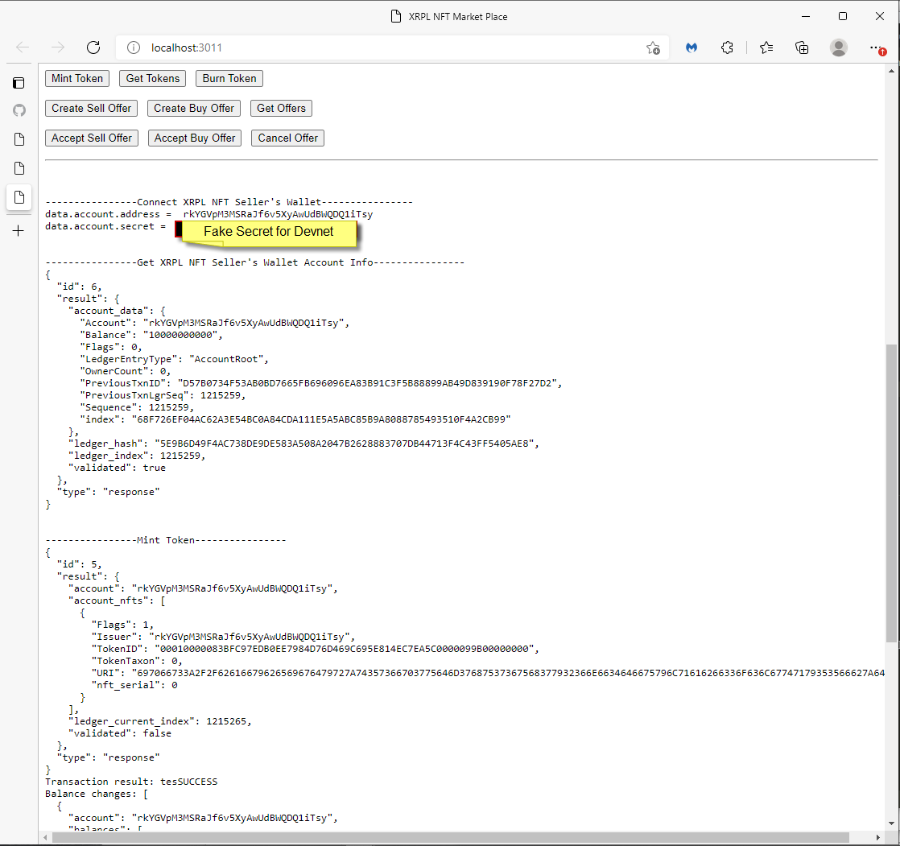

# xrpl-dev

## XRPL NFT Marketplace for the XRP Ledger
##      POC on XRP Ledger Devnet

## Build

Install nodejs  
npm install   
npm install xrpl   
npm install express   

## Run
node xrpl-nft-seller.js   

node xrpl-nft-buyer.js   

## Demo Screens
### Demo Screen 1:  Shows Successful Connection to Seller's XRPL Wallet

 

### Demo Screen 2:  Shows Successful Minting of Token (ML PDF Report)
